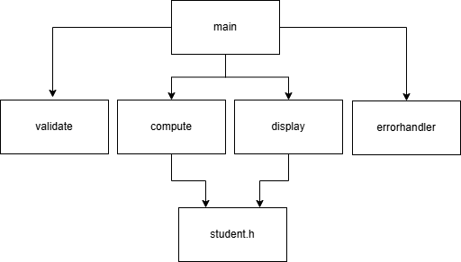

# Student Result Processing System

The diagram shows the modular structure of the Student Result Processing System.
main.c controls program execution and interacts with validation, computation, display, and error handling modules. compute and display modules depend on student.h for shared data structures.

## 1. Main Module (Controller)

- **File:** `main.c`
- **Purpose:** Controls the overall execution of the program
- **Input:** Input file name and output file name
- **Pre-condition:** Input file must exist and be readable
- **Logic:**
  - Reads student records from input file
  - Validates ID, name, and marks
  - Allows skipping invalid records
  - Calls computation and display modules
- **Output:** Result report written to output file

---

## 2. Student Data Module

- **File:** `student.h`
- **Purpose:** Defines data structures used across the app
- **Details:**
  - Stores student ID, name, subject details, total marks, percentage, and CGPA
  - Defines grade and grade point information
- **Output:** Structured student data shared between modules

---

## 3. Computation Module

- **Files:** `compute.c`, `compute.h`
- **Purpose:** Performs result-related calculations
- **Input:** Validated student record
- **Pre-condition:** Marks must be within valid range
- **Logic:**
  - Calculates subject total marks
  - Assigns grades and grade points
  - Computes total marks, percentage, and CGPA
- **Output:** Updated student record with computed results

---

## 4. Validation Module

- **Files:** `validate.c`, `validate.h`
- **Purpose:** Ensures correctness of input data
- **Input:** Student ID, name, and marks
- **Logic:**
  - Checks ID is alphanumeric and unique
  - Validates name contains only alphabets
  - Verifies marks are within allowed limits
- **Output:** Validation status

---

## 5. Error Handling Module

- **Files:** `errorhandler.c`, `errorhandler.h`
- **Purpose:** Handles invalid inputs instead of abrupt end
- **Logic:**
  - Displays clear error messages
  - Prompts user to skip the invalid record or stop execution
- **Output:** User decision to continue or terminate

---

## 6. Display Module

- **Files:** `display.c`, `display.h`
- **Purpose:** Generates output reports and statistics
- **Input:** Array of processed student records
- **Logic:**
  - Prints student-wise result table
  - Calculates class statistics
  - Displays grade distribution for each subject
- **Output:** Formatted result report
